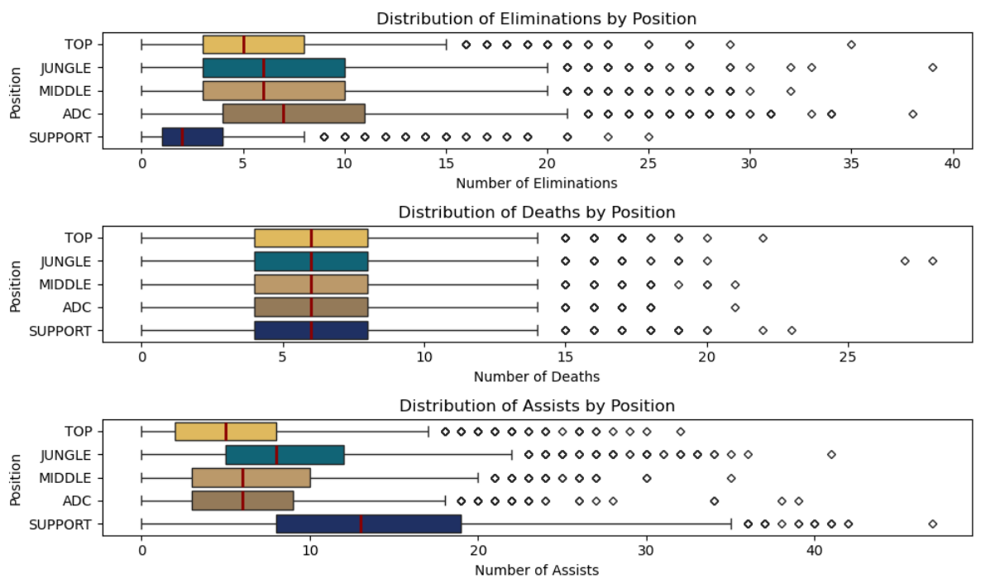
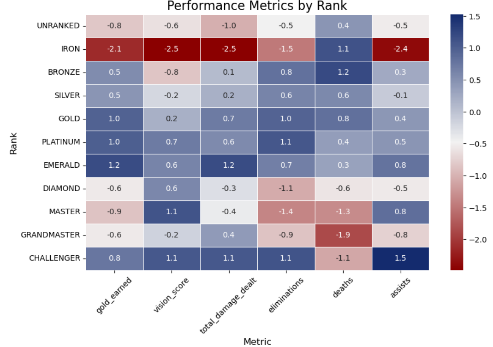
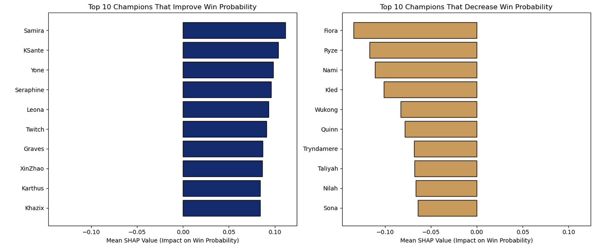

# Predicting Match Outcomes in League of Legends Based on Team Performance and Player Statistics

Please access the project notebook [here](https://nbviewer.org/github/Mohamed-Aymaan-Zahir/League-of-Legends-Match-Analysis/blob/main/League%20of%20Legends%20Match%20Analysis%20and%20Predictive%20Model.ipynb). For a summary of the work done and results, as well as the purpose of this project, and some useful information about the game, please continue reading!

## Introduction

As both an aspiring data scientist and a regular player of League of Legends, this project is an amazing platform to refine my data science skills while also obtaining useful insights about a topic I am heavily interested in. Utilising the techniques that I have learned throughout my degree while also employing new models and visualisation methods, and combining that with my domain knowledge about the game, this analysis will be useful for both players who are eager to gain more understanding about the factors that contribute towards winning games and other data scientists who are interested in the different techniques I employ to extract information and convey it in an enticing manner. To ensure this, the analysis notebook  is written and coded in a manner that explains each step that is done for those who do not have the technical knowledge. As for readers who are not familiar with the game, a short summary of the game is provided below.

---

## What is League of Legends?

_Credit: Karin Richter Gómez / Red Bull Content Pool_

League of Legends is a popular 5 versus 5 multiplayer online battle arena (MOBA) game developed and published by Riot Games that is played by well over 30 million players everyday on average. Players choose different characters, known as champions, each with a unique set of abilities, and players fight to earn gold, which can be used to buy items that make their characters stronger. The goal of the game is to work together to destroy the enemy base, protected by turrets and the enemy team itself. Before each game, every player chooses 1 of five different position:

1. **Top laner:** involves mostly playing 1 versus 1 against the enemy top lane to gain an experience lead and typically involves playing tank style champions.
2. **Jungler:** in charge of assisting all other players to get advantages in their lanes and securing neutral objectives.
3. **Middle Laner:** similar role to the top laner, but this player has more easy access to the rest of the map and typically serves a damage dealing role.
4. **ADC (Attack Damage Carry):** works with a support to gain items and provide most of the damage for the team. Usually consists of long range champions.
5. **Support:** in charge of providing utility to the team in terms of healing, shielding, crowd control (abilities that hinder the enemy's ability to fight or move) and gaining vision of the enemy team.

The game consists of three main modes: the Classic mode (also known as Summoner's Rift), ARAM (short for All Random All Mid) and Swiftplay. Although all modes are represented in the dataset, the focus of this analysis is only on the Classic mode. This mode is split into two versions, draft pick, which is the casual mode that has no consequences for winning or losing, and ranked, which is a mode where players are matched against other players of similar skill levels (ranks). These ranks range from Iron to Challenger, with 4 subdivisions within each rank, and players improve their rank by gaining points known as LP from winning and vice versa from losing. The ranked mode is further divided into two, with one ranked mode for playing alone (solo) and another ranked mode for playing with a group of friends (flex).

Other terminology used in the notebook are described in the context it is used.

---

## Data Pipeline

### a) Raw Data

The data that was used is the League of Legends Match Dataset (2025) by user Jacob Krasuski from [Kaggle.com](https://www.kaggle.com/datasets/jakubkrasuski/league-of-legends-match-dataset-2025) under the license  CC BY 4.0 (Creative Commons Attribution 4.0 International). The dataset is based on game data from Riot Games, the developer and publisher of League of Legends. Please refer to the original dataset source and Riot Games' policies for attribution and licensing details.

The original data consists of 40412 rows and 94 columns, with each row representing a unique player in a match and each column representing information about various aspects regarding the match and the player's performance within the match.

### b) Data Cleaning

The following steps were taken to clean the data:

1. Dropping columns that do not convey much useful information, are not relevant or columns that visibly have a lot of missing data.
2. Converting data types
3. Changing naming semantics
4. Filtering for the subset of the data to be used
5. Filling in and dropping null values
6. Feature engineering: splitting the date column, calculating derived performance metrics.

### c) Descriptive Analytics

In order to explore the data and gain information about the data overall, the following actions were done:

1. Calculating summary statistics for key values, including the mean, median, min, max and spread.
2. Visualising the correlation between key features using a correlation map
3. Visualising the distribution of summoner levels using a histogram

### d) Data Analysis

These are the various aspects of the data that I examined and visualised:

1. Performance of players based on their role: I checked the amount of data available for each role and the win rate of each position using a bar chart and stacked bar chart respectively. To further inspect win rates, I plotted a line graph for the Jungle and Support role win rates over different game versions. Additionally, I plotted the distribution of eliminations, deaths and assists for each role using boxplots.
2. Performance of players based on game duration: I examined how player performance changes depending on how long the game is by plotting scatterplots for the gold per minute against duration and the KDA against duration.
3. Performance of players based on solo rank: this involved visualising the differences in performance metrics between player ranks using a heatmap.

### e) Building the Classifier Model

I used a Catboost classifer model to predict match outcomes and win probabilities due to the existence of complex categorical columns in the data. I employed a 80:20 train-test split and fit the model with some slight manual hyperparameter tuning and calculated the area under the receiver operating characteristic curve (AUC), accuracy and logloss. Further testing the robustness of the test performance metrics, I performed 5 fold cross validation.

### f) Analysing the Classifier Model

I used the Shapley Additive Explanations library to plot the most important features in the model and analysed possible reasons for their significance. I also went further as to examine which champions have the most influence on improving and worsening win probabilities.

---
## Summary of Results

### **_Key Insights:_**
1. Achieved an 88% accuracy, 95% AUC and 0.27 logloss. These metrics did not change much when conducting cross validation.
2. Win rates do not differ by roles over time, even though on specific game versions some roles may have higher or lower win rates.
4. As expected, the amount of eliminations and assists that players get differ by roles, with support players having more assists on average and ADC players normally leading the elimination chart. However, the amount of deaths follows an almost identical distribution for each role, contrary to the belief that support and top lane players die more to save their team.
5. Player performance tends to peak when games are not too long, and diminishes as games take longer, seeing that player KDAs and gold per minute tend to be high for average length games and lower for very long games.
6. The performance of higher ranked players do differ quite a lot from lower ranked players, with higher ranked players outperforming them on almost every performance metric on average.
7. The most important features that contribute towards predicting a win probability are the number of assists, damage dealt to objectives and damage dealt to turrets, all of which potentially indicate better team coordination and focus on gaining advantages over the enemy team.
8. Champions that are usually easier and more accessible for lower ranked players might improve win probability more than obscure champions or champions with high skill expression.

### **_Example Graphs:_**

1.
 
_Distributions of Eliminations, Deaths and Assists By Role_

2.

_Difference in Player Performance Based on Rank_

3.

_Top 10 Champions That Positively And Negatively Influence Win Probability_

---

### **_Potential Limitations and Areas For Improvement:_**
1. All of the data related to players on the EU Nordic and East server. While not being a small server by any means, it is still not as popular as servers like Europe West, North America and Korea. As a result, the results obtained from this analysis may not be representative of the entire League of Legends player base, and may only be representative of players on this specific server.
2. Even though our predictive model ended up using a large number of predictors, there are still many more features that could have provided useful information to improve the model performance. These include the number of minions killed, which is a very important feature that was not included in the dataset, and the flex rank columns, which were removed due to the abundance of missing data.
3. With more time and computational resources, a better model may be obtained through automated hyperparameter tuning, but given that a good model was fit with relatively little tuning, this limitation is not so severe.
4. This project only focused on the Classic Summoner's Rift mode, but there is still data on the ARAM and Swiftplay modes available, which may be useful to analyse in the future.

---

## Acknowledgements

Please refer to the [Acknowledgements Wiki Page](https://github.com/aymaan-kj/League-of-Legends-Match-Analysis/wiki/Acknowledgements) for a full list of resources used in this project.
